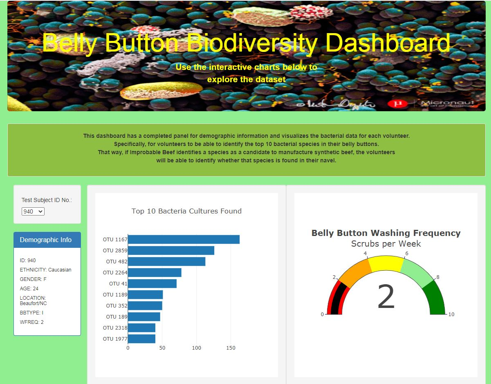
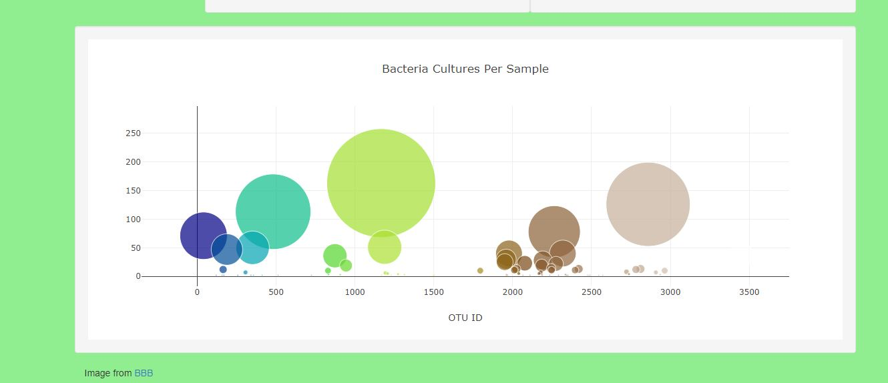

# BBB_Dashboard

webpage: https://bksuro.github.io/BBB_Dashboard/

Images:

  
  
  

Deliverable 4 tasks done:
  - Add an image to the jumbotron.
  - Add background color or a variety of compatible colors to the webpage.
  - Add more information about the project as a paragraph on the page.
  - Make the webpage mobile-responsive.
